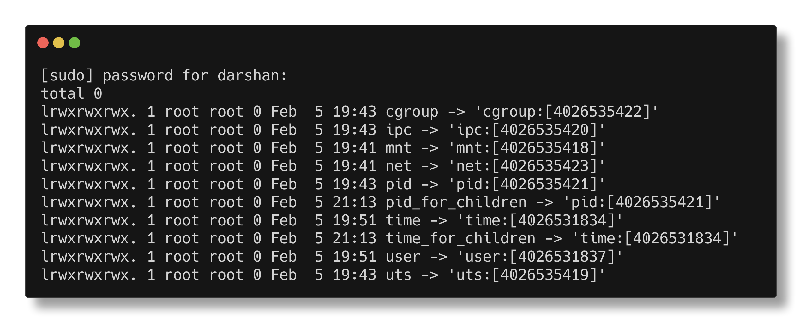

import PidNamespaceDemo from '@site/src/components/PidNamespaceDemo';


# Namespaces

This comes straight from the `man namespaces` command:

> A  namespace **wraps a global system resource in an abstraction that makes it appear to the processes within the namespace that they have their own isolated instance of the global resource**.  Changes to the global resource are visible to other processes that are members of the namespace, but are invisible to other processes.  **One use of namespaces is to implement containers**.


## Namespace glimpse:

We will dive into the theory later first see it for yourself:


```bash
# Check current hostname
 $ hostname
<your hostname>

# we will go inside a new namespace and change the hostname
 $ sudo unshare -u /bin/bash
# you are now inside the namespace
$ hostname
<your hostname>
$ hostname newhostname
$ hostname
newhostname

# In another terminal you will still see the old hostname because we are in our host machine
 $ hostname
<your hostname>
```

You see! Its like a silo for your process. It has a different hostname but its just its view, the rest of the system still sees the old hostname.


Lets see what kind of namespaces were created for our nginx container:

```bash
docker ps #note your container id
PID=$(docker inspect -f '{{.State.Pid}}' <container id>)
sudo ls -l /proc/$PID/ns
```



So many namespaces! where did they come from, what does each do?

## Analogy

Imagine the movie **Inception**, where you are inside a dream. 

Each dream level has its own physical environment. Similarly, your container thinks it has its own root filesystem at `/`, completely unaware that it just a location in the host's filesystem. 

It has a different hostname, different process ids, different network interfaces, different users and groups, different capabilities, different limits in its own little world. But in reality its just a view it is seeing of an actual resources created on the host machine. 

As we saw in the previous section, the container is just a process running on the host machine. The only difference is that the silo it is seeing is created by the Linux namespaces.


**Here's a little animation to explain the concept**:

<PidNamespaceDemo />

In the visualization above, 
- the new myapp process has an actual pid of 847 on the hostmachine 
- but inside the new pid namespace it has pid 1 because its the only process in it yet! 
- any child processes created from this process will also end up in this new pid namespace 
- and will be assigned pids starting from 2,3 and so on with corresponding actual pids in the host machine. 

:::tip

**Namespaces are just kernel resource wrappers.**

:::

## List of Namespaces

There are many namespaces, each serve a different purpose and were introduced at different point in times as the kernel evolved. 

Here is the map:

| Namespace Type | Isolates | Key Characteristics |
| :--- | :--- | :--- |
| **Mount** | Filesystem mount points | Isolates filesystem view, allows different mount tables |
| **UTS** | Hostname and domain name | Isolates system identifiers returned by `uname()` |
| **IPC** | Inter-Process Communication | Isolates System V IPC and POSIX message queues |
| **Network** | Network stack | Complete isolation of network interfaces, routing, firewall rules |
| **PID** | Process IDs | Isolates process ID hierarchy, allows multiple PID 1 processes |
| **User** | User and Group IDs | Isolates UID/GID mappings, enables rootless containers |
| **Cgroup** | Cgroup root | Isolates cgroup hierarchy view, virtualizes /proc/self/cgroup |
| **Time** | System clocks | Isolates clocks |


**You may be reading terms like uts,cgroups for the first time. Don't worry we will cover them in detail in the upcoming sections.**

We will check the major namespaces in the next sections. Before that you need to know how to interact with namespaces or check resources created by them. 

We will cover that in the [next section](./underthehood.mdx).

## They are not just for containers

[There are many other ways of os resource virtualization apart from docker](https://en.wikipedia.org/wiki/OS-level_virtualization#Implementations). 

Docker, podman and other tools like LXC use namespaces to create containers. 

But snapd,flatpak too use namespaces to create isolated environments for their getting only a minimal set of resources their process needs. You can even isolate [systemd](https://www.redhat.com/en/blog/mastering-systemd) services in their own namespaces.
