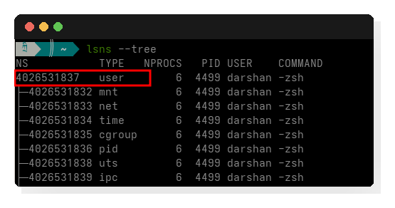
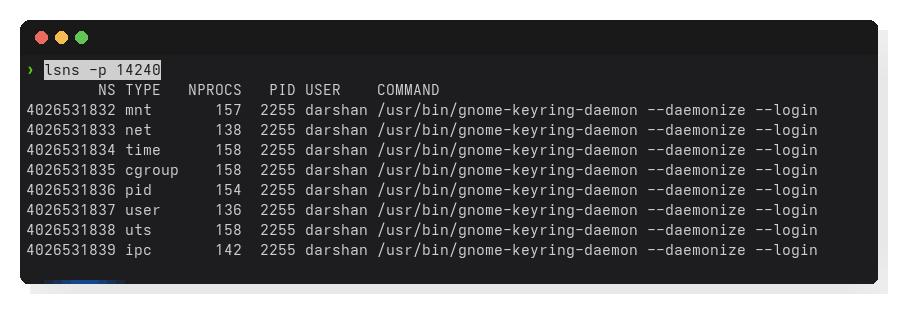
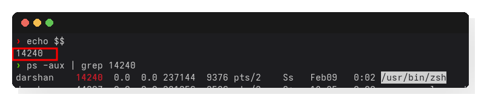

import UnshareDemo from '@site/src/components/UnshareDemo';


# Under the hood

We will try to understand how to look at and enter namespaces using the tools available to us. We will also try to understand the /proc filesystem which is a major concept to be aware about.


## Checking the namespaces

Lets see the namespaces on our machine:

```bash
lsns --tree
```

When i ran it on fresh machine i got:



When i ran it on another machine with browser and other processes i got:


You see all the namespaces are connected to each other in a tree like structure. The user namespace is at the root of the tree. There is a reason for this, we will cover that in the [this section in detail](http://localhost:3000/docs/namespaces/namespaces/user_namespaces#why-user-namespaces-are-the-root-namespace).

Apart from this you see the other namespaces like the net,mnt,time namespaces etc.

You can also see the namespaces for a certain process using `lsns -p <pid>`




## The /proc Filesystem

Lets check your current shell process, run `echo $$` in your shell, it will give you a process id.

You can confirm the same using `ps -aux | grep <pid>`.



This is a "pseudo-filesystem." It doesn't exist on your hard drive; it exists in the RAM.

    Navigate to /proc/[pid]/ns/. This is where the kernel actually exposes the namespaces associated with a specific process. If you can't navigate /proc, namespaces will feel like "black box" magic rather than visible system files.


## Looking into the nsenter

## whats unshare


<UnshareDemo />

## clone command

