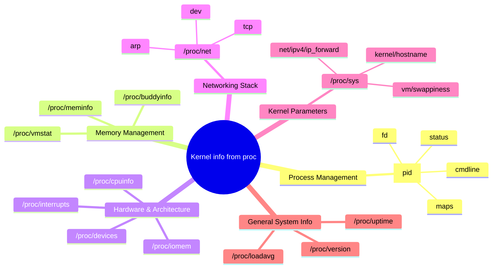

import UnshareDemo from '@site/src/components/UnshareDemo';


# Under the hood

We will try to understand how to look at and enter namespaces using the tools available to us. We will also try to understand the /proc filesystem which is a major concept to be aware about.

:::tip

You can run the next steps as the root user if you face any permission issues.

:::

## Checking the namespaces

Lets see the namespaces on our machine:

```bash
lsns --tree
```

When i ran it on fresh machine i got:


When i ran it on another machine with browser and other processes i got:


You see all the namespaces are connected to each other in a tree like structure. The user namespace is at the root of the tree. There is a reason for this, we will cover that in the [this section in detail](http://localhost:3000/docs/namespaces/namespaces/user_namespaces#why-user-namespaces-are-the-root-namespace).

Apart from this you see the other namespaces like the net,mnt,time namespaces etc.

You can also see the namespaces for a certain process using `lsns -p <pid>`


## The /proc Filesystem


To get the picture, there is no better way than the next command:

```bash
watch -n0.5 cat /proc/uptime
```


Do you see the file `/proc/uptime` updating realtime?! Is this the file the `uptime` command refers?

- `/proc` is a virtual filesystem exposed by the Linux kernel.
- While it looks like a normal directory filled with files, it isnt. 
    - Files are not on disk
    - Contents are generated on the fly
    - **Reading a file = asking the kernel a question**
    - **You can also update files** in /sys folder and update kernel parameters. eg `sudo sysctl -w net.ipv4.ip_forward=1` is actually updating `/proc/sys/net/ipv4/ip_forward` file. 

:::info
The `/proc` filesystem does not exist on your hard drive. It is created in memory by the kernel on the fly.
:::

Think of it as a window into the kernel. It exposes internal kernel data (information about processes, memory, hardware, and configurations) as if they were standard text files.

- It is dynamic: If you read a file in `/proc`, the kernel generates the content at that exact moment.
- It is ephemeral: If you shut down your computer, everything in `/proc` vanishes because it lives in RAM.
- "Everything is a file": This adheres to the Unix philosophy. You can use standard tools like cat, less, and grep to read kernel data


:::info

/proc is actually mounted on your host machine. Run `mount | grep proc` to see it. This understanding will be important later.

:::


**So what kind of data can I get from `/proc`?**

Run `ls /proc` on your machine.

:::tip
You can zoon images by clicking them
:::


The left side of folders are specific for each process, yup each process! and the ones on the right are the files for the global data like uptime,meminfo,cpuinfo etc. 


Heres a brief map to know the main files/folders in the `/proc` folder, if you are interested to look deeper, I recommend running `apropos proc_` command and having a look at man pages for anything you are interested inside proc.

<br />
<br />




<br />
<br />
<br />

run the following command:

```bash
ls -l /proc/$$/
```

These are the files for the current process, zsh in my case.


### Why is `/proc` important in containers?

Namespaces and cgroups (covered in the next phase) are the core technologies that enable containers.

But there is an important question:

> If namespaces create isolation, how does a process *see* that isolated world?

The answer is: **`/proc`**.

We know by now that:

> `/proc` is the window through which a process sees the system.

When a container starts:

* A new set of namespaces is created
* A new mount namespace is prepared (we will see this in detail in the mount namespace section)
* `/proc` is mounted inside that container’s filesystem

**Because `/proc` is namespace-aware**, it only shows:

* The processes visible inside that container
* The system identity assigned to that container

So even though the container runs on the same host, its `/proc` presents a filtered and isolated view.

**That filtered view is what creates the container illusion.**

> Namespaces create isolation, but `/proc` makes that isolation visible.

Container runtimes themselves inspect:

```
/proc/<pid>/ns
/proc/<pid>/cgroup
/proc/<pid>/mountinfo
```

Without `/proc`, container tools would have no way to understand or manage isolation boundaries.Containers would be effectively blind.

A container is simply:

```
A process
  + Namespaces
  + Cgroups
  + A filesystem
```

And `/proc` is the lens through which that process experiences its isolated environment.


## whats unshare


## Looking into the nsenter

Entering Existing Namespaces with nsenter

Purpose: join namespaces of another process.

Syntax:

```bash
nsenter --target <pid> [options]
```

Step 1: Find a process

From host:

ps aux | grep bash


Find PID of your unshare shell.

Step 2: Enter its mount namespace

```bash
sudo nsenter --target <PID> --mount bash
```

You are now inside that process’s mount namespace.

Step 3: Enter PID namespace

```bash
sudo nsenter --target <PID> --pid --mount-proc bash
```

How it works

It reads:

```bash
/proc/<PID>/ns/*
```

And attaches your process to those namespaces.

<UnshareDemo />

## clone command

