import NamespaceVisualizer from '@site/src/components/NamespaceVisualizer';


# Under the hood

We will try to understand how to look at and enter namespaces using the tools available to us. We will also try to understand the /proc filesystem which is a major concept to be aware about.

:::tip

You can run the next steps as the root user if you face any permission issues.

:::

## Checking the namespaces

Lets see the namespaces on our machine:

```bash
lsns --tree
```

When i ran it on fresh machine i got:


When i ran it on another machine with browser and other processes i got:


You see all the namespaces are connected to each other in a tree like structure. The user namespace is at the root of the tree. There is a reason for this, we will cover that in the [this section in detail](http://localhost:3000/docs/namespaces/namespaces/user_namespaces#why-user-namespaces-are-the-root-namespace).

Apart from this you see the other namespaces like the net,mnt,time namespaces etc.

You can also see the namespaces for a certain process using `lsns -p <pid>`


## The /proc Filesystem


To get the picture, there is no better way than the next command:

```bash
watch -n0.5 cat /proc/uptime
```


Do you see the file `/proc/uptime` updating realtime?! Is this the file the `uptime` command refers?

- `/proc` is a virtual filesystem exposed by the Linux kernel.
- While it looks like a normal directory filled with files, it isnt. 
    - Files are not on disk
    - Contents are generated on the fly
    - **Reading a file = asking the kernel a question**
    - **You can also update files** in /sys folder and update kernel parameters. eg `sudo sysctl -w net.ipv4.ip_forward=1` is actually updating `/proc/sys/net/ipv4/ip_forward` file. 

:::info
The `/proc` filesystem does not exist on your hard drive. It is created in memory by the kernel on the fly.
:::

Think of it as a window into the kernel. It exposes internal kernel data (information about processes, memory, hardware, and configurations) as if they were standard text files.

- It is dynamic: If you read a file in `/proc`, the kernel generates the content at that exact moment.
- It is ephemeral: If you shut down your computer, everything in `/proc` vanishes because it lives in RAM.
- "Everything is a file": This adheres to the Unix philosophy. You can use standard tools like cat, less, and grep to read kernel data


:::info

/proc is actually mounted on your host machine. Run `mount | grep proc` to see it. This understanding will be important later.

:::


**So what kind of data can I get from `/proc`?**

Run `ls /proc` on your machine.

:::tip
You can zoon images by clicking them
:::

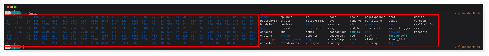


The left side of folders are specific for each process, yup each process! and the ones on the right are the files for the global data like uptime,meminfo,cpuinfo etc. 


Heres a brief map to know the main files/folders in the `/proc` folder, if you are interested to look deeper, I recommend running `apropos proc_` command and having a look at man pages for anything you are interested inside proc.

<br />
<br />


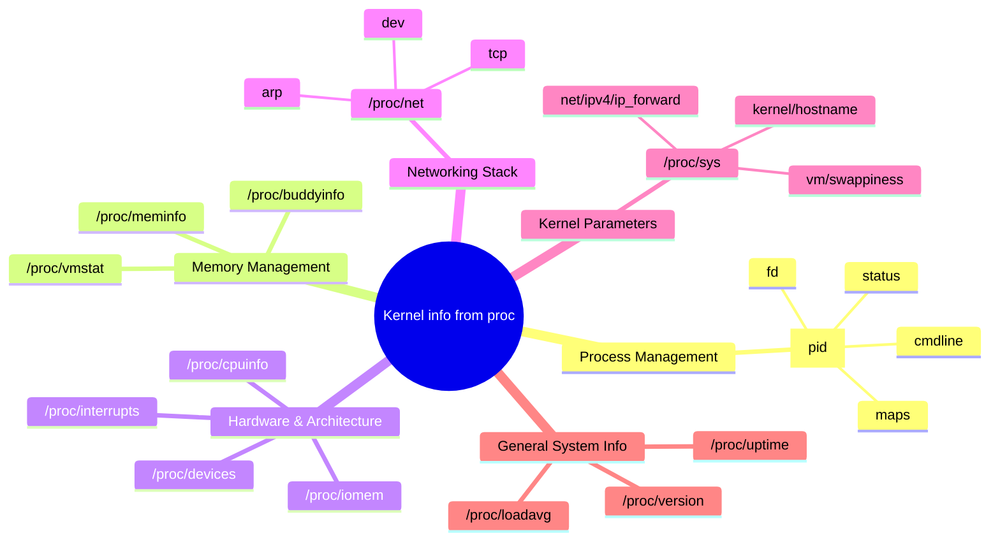

<br />
<br />
<br />

### Namespaces are shared by default

run the following command:

```bash
ls /proc/$$/
```

These are the files for the current process [$$], zsh in my case.


You can check the status of the process using `cat /proc/$$/status | head`

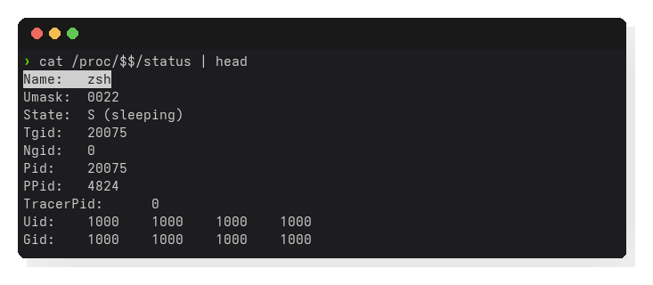

You can also look at the namespaces of the process using `ls -la /proc/$$/ns`, The numbers in brackets are unique identifiers for each namespace.

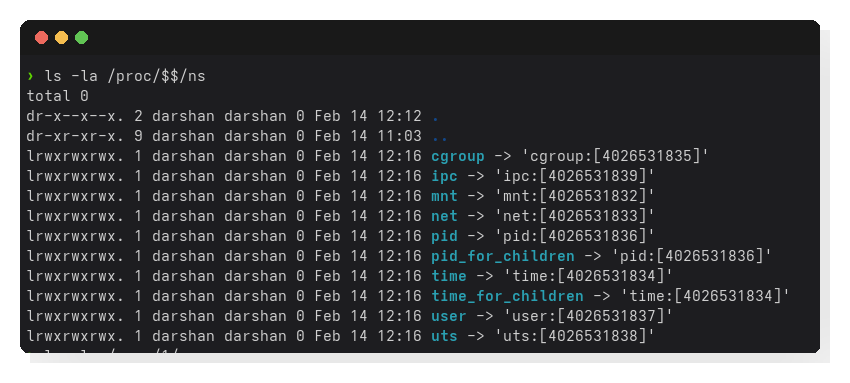

Now lets check the namespaces of the systemd process [pid 1] using `sudo ls -la /proc/1/ns` [**dont miss the sudo**]

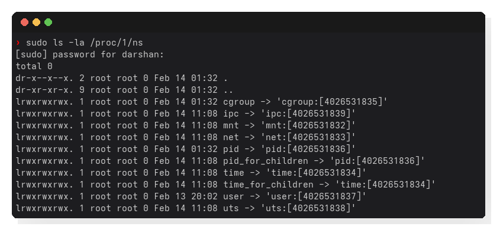

The namespaces of the systemd process are the same as the current process! 

Meaning all namespaces are **shared**. *Until we unshare them later on* 😉

### Why is `/proc` important in containers?

Namespaces and cgroups (covered in the next phase) are the core technologies that enable containers.

But there is an important question:

> If namespaces create isolation, how does a process *see* that isolated world?

The answer is: **`/proc`**.

We know by now that:

> `/proc` is the window through which a process sees the system.

When a container starts:

* A new set of namespaces is created
* A new mount namespace is prepared (we will see this in detail in the mount namespace section)
* `/proc` is mounted inside that container’s filesystem

**Because `/proc` is namespace-aware**, it only shows:

* The processes visible inside that container
* The system identity assigned to that container

So even though the container runs on the same host, its `/proc` presents a filtered and isolated view.

**That filtered view is what creates the container illusion.**

> Namespaces create isolation, but `/proc` makes that isolation visible.

Container runtimes themselves inspect:

```
/proc/<pid>/ns
/proc/<pid>/cgroup
/proc/<pid>/mountinfo
```

Without `/proc`, container tools would have no way to understand or manage isolation boundaries.Containers would be effectively blind.

A container is simply:

```
A process
  + Namespaces
  + Cgroups
  + A filesystem
```

And `/proc` is the lens through which that process experiences its isolated environment.


## Unshare: to move process to new namespaces


[In the previous section](#namespaces-are-shared-by-default) we saw how to look at the namespaces of a process using `ls -la /proc/$$/ns` and **we saw that all namespaces are shared** right from the init process to the current process. 

🤔 But we know that we need to create new namespaces for our processes to be isolated. 

👉👉 Enter `unshare`. 

The unshare command runs a program (by default, your shell) with some namespaces "unshared" from its parent. 

**Basic Syntax:** 

```bash
unshare [options] [program [arguments]]
```

**Important Options**

| Option | Description |
|--------|-------------|
| `--mount`, `-m` | Unshare the mount namespace |
| `--pid`, `-p` | Unshare the PID namespace |
| `--net`, `-n` | Unshare the network namespace |
| `--uts`, `-u` | Unshare the UTS namespace |
| `--user`, `-U` | Unshare the user namespace |
| `--ipc`, `-i` | Unshare the IPC namespace |
| `--cgroup`, `-C` | Unshare the cgroup namespace |
| `--time`, `-T` | Unshare the time namespace |
| `--fork`, `-f` | Fork the child process (needed for PID namespace to work correctly) |
| `--mount-proc` | Mount a new procfs at `/proc` after creating the PID namespace (implies `--fork`) |
| `--propagation` | Set mount propagation (shared, slave, private, unbindable) for the new mount namespace |
| `--map-root-user` | Map the current (unprivileged) user to root inside the user namespace |


### Examples

💡 We already had a [glimpse](../namespaces/#namespace-glimpse) of how unshare works 💡, that was when we created a new uts namespace.

Lets look at a few more examples to understand how unshare works.

:::note Not yet

some namespaces like process,user need some more context before we can cover them at this point, they are covered in depth in their specific sections

:::

:::tip

Run all of these with sudo or as root. Namespace creation requires elevated permissions.

:::

**1. Network Namespace**


1. Create a new network namespace and run bash:
   ```bash
   sudo unshare --net bash
   ```

2. Inside, check network interfaces:

   ```bash
   ip a
   ```

   You’ll see only `lo` (loopback), and it’s probably down. 
   
   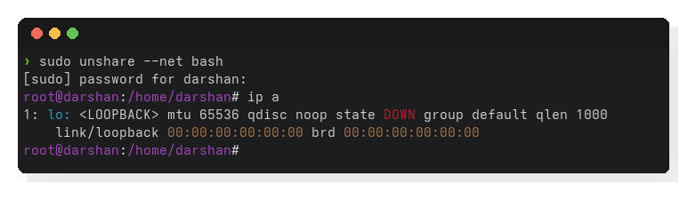
   
   
   Bring it up:
   ```bash
   ip link set lo up
   ping 127.0.0.1   
   ```
   
   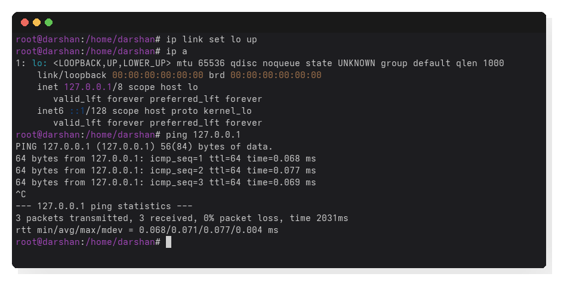

   But no other interfaces (eth0, wlan0) are present – the namespace is completely isolated from the host’s network.

   How will we communicate with the host? to the internet!? We will cover that in the [network namespace section](./network_namespaces.md)


How do we confirm we are in a new namespace?

- **In your unshared shell**
    - run `echo $$` to get the pid of your bash process
- **In a different terminal shell [hostmachine]**:
    - check the network namespace of it using `sudo ls -la /proc/<pid>/ns | grep net`
    - check the network namespace of the host using `sudo ls -la /proc/1/ns | grep net`. You will see that the network namespace of the unshared shell is different from the network namespace of the host!

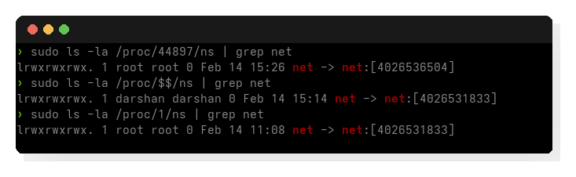

- Exit the unshared shell using `exit`

**2. Mount namespace**

Lets try unsharing the mount namespace.

Run the following:

```bash
sudo unshare --mount bash
```

Inside this shell:

```bash
ls -l /proc/self/ns/mnt
```

Compare with your host mnt ns. It will be a different number.

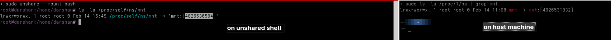

Step 2: Mount something private

- on the unshared shell:

    ```bash
    mkdir /tmp/mytest
    mount -t tmpfs tmpfs /tmp/mytest
    mount | grep mytest
    ```

You’ll see it mounted.

Open another terminal on host:

```bash
 mount | grep mytest
```

You will not see it! The mount is completely isolated to your new mount namespace.

:::info Ever wondered?
How docker containers have their own root filesystem and processes? Answer: mount namespaces! with help from pivot_root and procfs! 

We will explore this in depth in the next sections
:::


## Nsenter: enter existing namespaces

A container or pod is facing a problem. You use `docker exec`,`kubectl exec` to enter the container and debug it. You are essentianlly going into the namespace of the container and debugging it!

Enter nsenter [pun intended] :smile: 


[Container runtimes use similar functionality](https://pkg.go.dev/github.com/opencontainers/runc/libcontainer/nsenter)


**Syntax:**

```bash
nsenter --target <pid> [options]
```

### Example

Lets create a new process with unshared mount and uts namespaces and make some changes. 

```
sudo unshare --mount --uts bash

>> inside the unshared shell
mkdir /tmp/nsenter-test
mount -t tmpfs tmpfs /tmp/nsenter-test
hostname nsenter-test

echo $$ // note the pid
```

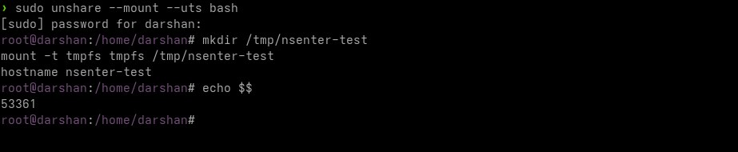

Let's say we found the PID to be `12345`.

**in a different terminal (host machine)**

Now, let's run `nsenter` to join its mount namespace.

```bash
sudo nsenter --target <pid> --mount --uts bash
```

Now you are inside the same namespaces as the target process!

**Lets verify** 🧐

- If you run `hostname`, you will see the unshared shell's custom hostname.
- If you run `mount | grep nsenter-test`, you will see the mount we created inside the unshared shell.

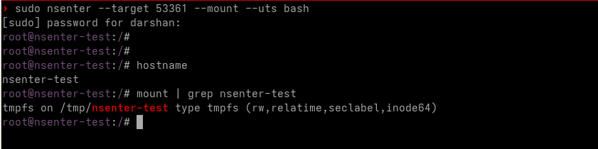


:::info imp

Use `nsenter --target <pid> --all` to enter **all** namespaces of the target process comfortably.

:::


## Clone: create new processes into namespaces

:::note

There is no bash shell command for clone its a kernel system call, but the concept is important to understand non the less.

:::

We have seen `unshare` which helps us "detach" the current process (or a new child) from the current namespaces.

But how do tools like **Docker** or **Container Runtimes** create containers?

They use the **`clone()`** system call.

While `fork()` creates a copy of the parent process sharing the **same** namespaces, `clone()` allows creating a new child process **directly** into new namespaces.

*   `fork()` = Child inherits parent's namespaces.
*   `clone(CLONE_NEWPID | CLONE_NEWNS)` = Child starts in **NEW** namespaces.

This is the most efficient way to spawn containers. The parent (Container Engine) remains in the host namespace, supervising, while the child (The Container) starts its life in a fresh, isolated world.

:::info
The `unshare` command we used earlier actually uses `unshare()` system call, but when you pass `--fork`, it behaves very similarly to `clone()` by creating a new child in the new namespaces.
:::

## Visualizing the tools


### Key Difference: unshare() vs clone()

While both can result in a process running in a new namespace, they approach it differently:

| Feature | `unshare()` | `clone()` |
| :--- | :--- | :--- |
| **Action** | **Modifies** the *current* process (mostly). | **Creates** a *new* child process. |
| **Namespace Creation** | Existing process unshares its namespaces from parent. | New child is born directly into new namespaces. |
| **Primary Use Case** | Shell commands, entering namespaces, manual setups. | Container Runtimes (Docker, runc) spawning containers. |
| **PID Namespace Quirk** | Requires `fork()` afterwards to truly be PID 1 in new NS. | Can become PID 1 immediately if `CLONE_NEWPID` is used. |


<NamespaceVisualizer /> 

