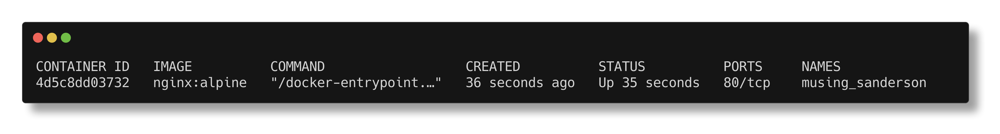
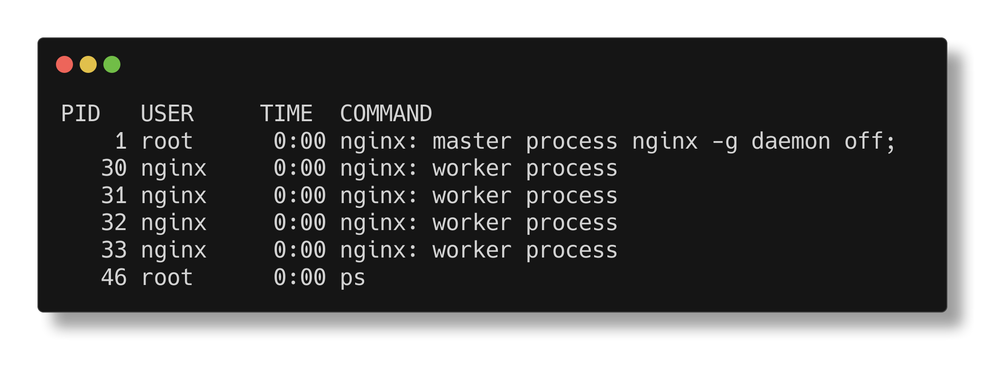
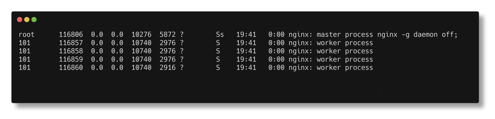

# Its just a Process!


:::note

Ensure you have docker installed on the machine and have sudo access to the machine

:::

Lets run a container!

```bash
docker run -d nginx:alpine
```

Confirm its running

```bash
docker ps
```

You should see something like this: 



Lets check the processes running on the container:

```bash
docker exec -it <container id> ps
```

You see it only has nginx process in it:




Now open a new terminal tab and run **`ps aux | grep nginx`**

You will end up seeing something like:



Wait, what? I thought I was running a container? Why is nginx running on my host machine?


The pid 1  `nginx: master process nginx -g daemon off` you see inside the container is actually running on your host machine as pid 116806 [in my case] but the container thinks its the main process for its own little world.

Docker didnot do any kind of virtualization, it just asked the Linux kernel to start a normal process with special features. The one feature we will look at in this section is **`namespaces`**
