# Under the Hood

This mapping reveals the "hidden plumbing" of the container world. Most people stop at "Docker runs containers," but the reality is a chain of command involving at least five distinct binaries, each with a specialized role.

### The High-Level Map

Think of this like a construction project. You (the client) talk to the Architect, who talks to the Foreman, who hires a Subcontractor, who actually wields the hammer.

**The Hierarchy:**


---

### Phase 1: The Manager Layer (User to Engine)

**1. Docker CLI (`docker`)**

* **Role:** The Interface.
* **What it does:** It doesn't "run" anything. It just converts your command (`docker run -it nginx`) into a JSON REST API payload.
* **The Action:** It sends a `POST /containers/create` and `POST /containers/start` request to the Docker socket (`/var/run/docker.sock`).

**2. Dockerd (`moby`)**

* **Role:** The Architect (Project Moby).
* **What it does:** This is the persistent daemon. It manages "Docker objects" (Networks, Volumes, Images).
* **The "Unknown" Workflow:**
* It checks if the image exists. If not, it pulls it (using internal logic, not BuildKit, unless you are building).
* It creates the **OverlayFS** layers for your container (Read-Write layer).
* It sets up the **Networking** (allocates an IP from the bridge, sets up iptables).
* *Crucial Handoff:* Once the environment is prepped, it calls **Containerd** via gRPC to actually "execute" the process.


---

### Phase 2: The Supervisor Layer (Engine to Runtime)

**3. Containerd (`containerd`)**

* **Role:** The Foreman.
* **What it does:** It manages the *lifecycle* of containers. It doesn't care about "Docker" networks or volumes; it just cares about running a bundle of code.
* **The Workflow:**
* It receives the request from Dockerd.
* It unpacks the image into a "Bundle" (a folder with a `config.json` file OCI spec).
* It **does not** spawn the container directly. If it did, and you restarted Containerd (to upgrade it), all your containers would die.
* Instead, it spawns a **Shim**.


**4. Containerd Shim (`containerd-shim-runc-v2`)**

* **Role:** The Middleman / Babysitter.
* **Why it exists (The "Unknown" part):**
1. **Decoupling:** It allows Containerd (and Dockerd) to restart/upgrade without killing the running containers.
2. **Reaping:** It acts as the parent of the container process to handle "zombie processes" (PID 1 duties) if the container doesn't do it.
3. **IO:** It holds the `stdin/stdout/stderr` streams open so you can see logs even if Dockerd restarts.


* **The Action:** The shim lives as long as the container is running. If you run `ps aux | grep shim`, you will see one shim process per running container.

---

### Phase 3: The Execution Layer (Runtime to Kernel)

**5. Runc (`runc`)**

* **Role:** The Mechanic (OCI Runtime).
* **What it does:** It is a short-lived CLI tool. It does the heavy lifting with the Linux Kernel.
* **The Workflow:**
* The Shim calls `runc create` and `runc start`.
* Runc reads the `config.json` provided by Containerd.
* **The Magic:** Runc talks to the Kernel to:
* **Namespaces:** Create the walls (PID, Mount, Network isolation).
* **Cgroups:** Set the limits (CPU, Memory).
* **Capabilities:** Drop root privileges (e.g., block `reboot` command).
* **Seccomp:** Filter system calls.


* **The Exit:** Once the user process (e.g., `nginx`) is started inside the container, **Runc exits**. It does not stay running. The Shim takes over ownership of the process.


---

### The "Alternative" Paths

You mentioned **nerdctl**, **ctr**, and **BuildKit**. Here is where they fit:

**1. Nerdctl**

* **Mapping:** `User -> Nerdctl -> Containerd`
* **Difference:** It bypasses the Docker Daemon (`dockerd`) entirely.
* **Why use it?** It supports newer Containerd features that Docker hasn't adopted yet (like lazy-pulling images, encrypted images, or bypass4netns). It is "Docker CLI for Containerd."

**2. Ctr**

* **Mapping:** `User -> Ctr -> Containerd`
* **Difference:** This is a raw debugging tool shipped with Containerd. It is not meant for humans.
* **Gotcha:** If you pull an image with `docker pull`, `ctr` won't see it by default because Docker uses a namespace called `moby`, while `ctr` defaults to `default`. You have to use `ctr -n moby ...` to see Docker's containers.

**3. BuildKit**

* **Mapping:** `User -> Docker CLI -> BuildKit Daemon`
* **Role:** It replaces the legacy "docker build" engine.
* **Workflow:** When you run `docker build`, the CLI talks to BuildKit. BuildKit constructs the image layers in parallel and pushes them to the local Docker cache. It sits *alongside* Containerd but doesn't run your production containers.

### Summary: The Chain of Command

When you type `docker run alpine sleep 10`:

1. **Docker CLI:** "Hey Dockerd, run alpine."
2. **Dockerd:** "Okay, network is ready. Hey Containerd, run this bundle."
3. **Containerd:** "Roger. Spawning a Shim."
4. **Shim:** "I'm up. Calling Runc."
5. **Runc:** "Kernel, give me a new PID namespace. Okay, process started. Bye!"
6. **Shim:** "I'm watching the process now."
7. **Containerd:** "Process is running."
8. **Dockerd:** "Client, here is your Container ID."

## OCI Spec


The **OCI spec** (Open Container Initiative specification) is a set of open, vendor-neutral standards that define the format and runtime behavior of container images and their execution environments. It ensures interoperability across different container tools and platforms, preventing vendor lock-in and enabling a consistent ecosystem for container-based software packaging, distribution, and deployment.

### 🔍 Core OCI Specifications
The OCI spec comprises three primary specifications, each addressing a specific aspect of the container lifecycle:

| Specification | Purpose | Key Components | Example Use Case |
| :--- | :--- | :--- | :--- |
| **Image Format Specification** (`image-spec`) | Defines the structure of a container image, including its layers, configuration, and manifest. | Image Manifest, Image Index (for multi-architecture support), Image Layout | Building a container image that includes the application code, dependencies, and runtime configuration. |
| **Runtime Specification** (`runtime-spec`) | Defines how to execute a container from a prepared filesystem bundle on a host system. | Runtime Bundle (config.json + rootfs/), settings for namespaces, cgroups, hooks | Running a container on a specific host OS using `runc`, `crun`, or other OCI-compliant runtimes. |
| **Distribution Specification** (`distribution-spec`) | Defines a standard API protocol for pushing and pulling container images and other artifacts to/from registries. | Push/Pull API for blobs, manifests, tags, referrers | Uploading a built image to Docker Hub, GitHub Container Registry, or a private registry. |

---

### 📦 How the OCI Specifications Work Together
The following diagram illustrates how these three specifications collaborate throughout the container lifecycle, from image creation to execution.

```mermaid
flowchart LR
    A[1. Build Image<br>（image-spec）] --> B[2. Push to Registry<br>（distribution-spec）]
    B --> C[3. Pull Image<br>（distribution-spec）]
    C --> D[4. Unpack to Bundle<br>（image-spec）]
    D --> E[5. Execute Container<br>（runtime-spec）]
    
    style A fill:#e3f2fd,stroke:#2196f3,color:#0d47a1
    style B fill:#bbdefb,stroke:#2196f3,color:#0d47a1
    style C fill:#bbdefb,stroke:#2196f3,color:#0d47a1
    style D fill:#90caf9,stroke:#2196f3,color:#ffffff
    style E fill:#64b5f6,stroke:#2196f3,color:#ffffff
```



1.  **Image Building (`image-spec`)**: A container image is built according to the **Image Format Specification**. It consists of a **manifest** (which references configuration and layers) and a set of **layers** (filesystem changes) and a **configuration** (metadata like entrypoint, environment variables).
2.  **Distribution (`distribution-spec`)**: The built image is pushed to a container registry using the **Distribution Specification**'s standardized API. The registry stores the image's blobs (layers and config) and manifests, allowing them to be retrieved by their content-addressable digests.
3.  **Image Pulling**: A container engine or runtime (like `containerd`, CRI-O) pulls the required image from the registry by fetching its manifest and the referenced blobs.
4.  **Unpacking to Bundle**: The pulled image is unpacked onto a host's filesystem. The **Image Layout** specification defines how these components are organized on disk. The result is an **OCI Runtime Bundle** – a directory containing a `config.json` file (derived from the image config and host-specific settings) and the root filesystem (`rootfs/`) composed from the image layers.
5.  **Container Execution (`runtime-spec`)**: An **OCI-compliant runtime** (like `runc`, `crun`) reads the `config.json` from the bundle. It sets up the required isolation mechanisms (namespaces, cgroups, SELinux profiles, etc.) and executes the container process as specified in the configuration.

---

### ⚙️ Key Benefits of the OCI Specification
The OCI spec brings several critical advantages to the container ecosystem:

*   **🔄 Interoperability**: Images built with one toolchain (e.g., Podman, Buildah) can be run by another (e.g., Docker, containerd, CRI-O) as long as they comply with the OCI spec. This allows organizations to choose the best tool for each stage of the container lifecycle without being locked into a single vendor.
*   **🔍 Verifiability & Reproducibility**: Every layer and configuration in an OCI image is identified by a cryptographic digest (e.g., `sha256:...`). This ensures that the exact same image bits are pulled and run across different environments, from a developer's laptop to production servers in the cloud.
*   **⚡ Efficient Distribution & Caching**: The image's layer-based, content-addressed model enables efficient storage and transfer. Layers shared across multiple images (e.g., a common base OS layer) are downloaded once and cached, reducing bandwidth and storage requirements.
*   **🏢 Standardized Registry Interaction**: The **Distribution Spec** provides a common API for interacting with container registries. This means any OCI-compliant registry (public or private) can work seamlessly with any OCI-compliant tool that pushes or pulls images.

---

### 🛠️ Common OCI Tools and Implementations
Many widely used container tools implement or are built upon the OCI specifications:

| Tool / Component | Role in OCI Ecosystem | Specifications Implemented |
| :--- | :--- | :--- |
| **runc** | The most widely used OCI-compliant CLI tool for spawning and running containers. | `runtime-spec` |
| **containerd** | An industry-standard container runtime with an emphasis on simplicity, robustness, and portability. It manages the complete container lifecycle of its host system. | `runtime-spec`, `image-spec`, `distribution-spec` |
| **Podman** | A daemonless container engine for developing, managing, and running OCI Containers. | `runtime-spec`, `image-spec`, `distribution-spec` |
| **Buildah** | A tool that facilitates building OCI images from a Dockerfile or from scratch. | `image-spec` |
| **Skopeo** | A command-line utility for performing various operations on container images and image repositories. | `distribution-spec` |
| **Docker** | While Docker originated the OCI effort, its core components (`containerd` and `runc`) are now OCI-compliant implementations. | `runtime-spec`, `image-spec`, `distribution-spec` |

---

### 🧩 Beyond Containers: OCI as a Generic Package Format
The principles of the OCI spec, particularly its layering, content-addressing, and distribution API, are increasingly being applied to package and distribute software artifacts that are not traditional container images. This includes:

*   **Helm Charts**: Kubernetes packages can be distributed using OCI registries.
*   **Terraform Modules**: Infrastructure-as-code modules can be versioned and distributed via OCI.
*   **Signatures and SBOMs**: Security metadata can be attached to OCI artifacts using the **referrers API** defined in the distribution spec.
*   **WASM Modules**: WebAssembly modules can be packaged and distributed using OCI.

This trend positions OCI as a potential universal standard for software artifact distribution.

---

### ⚠️ Important Considerations
While the OCI spec provides immense benefits, it's important to understand its limitations:

*   **Compliance ≠ Security**: Being OCI-compliant ensures packaging and reference integrity, but it **does not guarantee** that an image is free from vulnerabilities or that secrets are not embedded within layers. Security scanning and best practices are still essential.
*   **Runtime Behavior Varies**: The **Runtime Spec** standardizes the *configuration* of a container, but the actual execution behavior and isolation guarantees depend on the **specific runtime implementation** (e.g., `runc`, `crun`, `kata Containers`) and the **host operating system's kernel features**.
*   **Tag Mutability**: Tags (e.g., `latest`, `v1.0`) are mutable pointers to manifests. For immutable, reproducible deployments, always pin to a specific **digest** (e.g., `myimage@sha256:...`).

---

### 📚 Summary
In essence, the **OCI spec** is the foundational standard that makes the modern container ecosystem possible. By defining a common language for how container images are built (`image-spec`), distributed (`distribution-spec`), and run (`runtime-spec`), it has fostered a vibrant, competitive, and interoperable market of container tools and platforms. This standardization is a key reason why containers have become the dominant unit of software deployment in cloud-native environments.

To learn more, you can visit the official [Open Container Initiative website](https://opencontainers.org/) or explore the specifications on GitHub:
*   [Image Specification](https://github.com/opencontainers/image-spec)
*   [Runtime Specification](https://github.com/opencontainers/runtime-spec)
*   [Distribution Specification](https://github.com/opencontainers/distribution-spec)

To understand the Open Container Initiative (OCI), you have to split your brain into two modes: **Storage** (Files on disk/registry) and **Execution** (Process on the kernel).

The OCI specification is actually **two** distinct specifications:

1. **The Image Spec:** How bits are stored (The shipping container).
2. **The Runtime Spec:** How bits are run (The crane lifting the container).

Here is the complete anatomy of both, and how to build them.

---

### Part 1: The OCI Image Spec (Storage)

When you "pull" an image, you are downloading an OCI Image. It is a dormant collection of files.

#### The Anatomy

An OCI Image Layout is a directory with a standard structure. If you look inside a raw OCI export, you see this:

```text
.
├── oci-layout        # Validates that this directory is an OCI layout
├── index.json        # The Entry Point (The "Table of Contents")
└── blobs/
    └── sha256/       # EVERYTHING lives here (Config, Layers, Manifests)
        ├── a1b2...   # A JSON file (Manifest)
        ├── c3d4...   # A JSON file (Image Configuration)
        └── e5f6...   # A Gzipped Tarball (Layer filesystem)

```

#### The Critical Files

**1. `index.json**`
This is the root. It points to the **Image Manifest**.

* **Role:** It says "I am an index, and my manifest is at `blobs/sha256/a1b2...`".
* **Why it exists:** It can point to multiple manifests (e.g., one for `amd64`, one for `arm64`). This is how multi-arch images work.

**2. The Manifest (`blobs/sha256/...`)**
This is the invoice. It lists the ingredients.

```json
{
  "schemaVersion": 2,
  "config": {
    "mediaType": "application/vnd.oci.image.config.v1+json",
    "digest": "sha256:c3d4...", 
    "size": 142
  },
  "layers": [
    {
      "mediaType": "application/vnd.oci.image.layer.v1.tar+gzip",
      "digest": "sha256:e5f6...",
      "size": 2800000
    }
  ]
}

```

* **Key Insight:** It separates the **Config** (metadata) from the **Layers** (filesystem).

**3. The Image Config (`blobs/sha256/c3d4...`)**
This is often confused with the Runtime Config. **This is NOT the file used by runc.** This is the metadata used by Docker/Containerd to *generate* the runtime config later.

* **Contains:** `Env`, `Cmd`, `Entrypoint`, `User`, `History`.
* **Role:** It tells the engine "When you run this, please set `PATH=/bin` and run `/app/start.sh`."

---

### Part 2: The OCI Runtime Spec (Execution)

When you "run" a container, the OCI Image is unpacked into an **OCI Runtime Bundle**. This is what `runc` actually reads.

#### The Anatomy

A Bundle is a directory on the host (often transient) that contains:

1. **`rootfs/`**: A directory containing the unpacked files from all the layers.
2. **`config.json`**: The "God File" for execution.

#### The `config.json` (The Runtime Spec)

This is the most important file for `runc`. It maps the high-level Intent (from the Image Config) to low-level Kernel Reality.

**Key Sections of `config.json`:**

* **`process`**: The command to execute.
```json
"process": {
  "args": ["/usr/bin/nginx"],
  "env": ["PATH=/usr/local/bin..."],
  "cwd": "/"
}

```


* **`root`**: Points to the filesystem.
```json
"root": {
  "path": "rootfs",
  "readonly": true
}

```


* **`mounts`**: Maps host files to container files.
* *Crucial:* This is where `/proc`, `/sys`, and `/dev` are explicitly mounted. The container doesn't get these "for free"; the spec demands they be mounted.


* **`linux`**: The Kernel Isolation (The "Container" part).
* **`namespaces`**: Lists what to isolate (`ipc`, `mount`, `network`, `pid`).
* **`resources`**: Cgroups configuration (Memory limits, CPU shares).
* **`seccomp`**: System call whitelisting.


---

### Part 3: How to Build OCI Specs with BuildKit

BuildKit usually outputs "Docker Images" by default, but you can force it to output pure OCI Layouts.

#### Option 1: Using `docker buildx` (Easiest)

You can tell Docker's BuildKit instance to output the OCI layout to a local directory instead of the Docker daemon.

```bash
# Create a fresh directory for the output
mkdir my-oci-image

# Build and export as OCI Layout
docker buildx build . \
  --output type=oci,dest=./my-oci-image \
  --tag my-image:latest

```

**Result:**
Inside `my-oci-image`, you will see `index.json`, `oci-layout`, and `blobs`. You can technically tar this folder and move it to a disconnected machine, and import it with `skopeo` or `ctr`.

#### Option 2: Using `buildctl` (The "Hard" Way)

If you are using raw BuildKit (without the Docker CLI wrapper), you use `buildctl`.

```bash
buildctl build \
    --frontend=dockerfile.v0 \
    --local context=. \
    --local dockerfile=. \
    --output type=oci,dest=./my-oci-bundle.tar

```

* **Note:** By default, `buildctl` with `type=oci` often creates a **tarball** of the layout, whereas `type=local` creates the directory structure.

#### How to convert that OCI Layout into a Runtime Bundle?

BuildKit creates the **Image Spec**. To get the **Runtime Spec** (`config.json`), you need an OCI runtime tool like `runc` or `umoci`.

**The Manual Workflow (Educational):**

1. **Build Image:** (As above, get the OCI layout).
2. **Unpack Bundle:** Use `umoci` (a tool specifically for manipulating OCI images).
```bash
# Unpack the image into a bundle called "my-bundle"
umoci unpack --image my-oci-image:latest my-bundle

```


3. **Inspect Bundle:**
```bash
cd my-bundle
ls
# Output: config.json  rootfs/

```


4. **Run it:**
```bash
sudo runc run my-container-id

```


### Summary of the Flow

1. **Dockerfile** (Source Code)
2. **BuildKit** (Builder) → Outputs **OCI Image Layout** (JSON Manifests + Compressed Blobs).
3. **Containerd/Umoci** (Manager) → Unpacks Image into **OCI Runtime Bundle** (`config.json` + `rootfs` directory).
4. **Runc** (Executor) → Reads `config.json`, talks to Kernel, starts process.